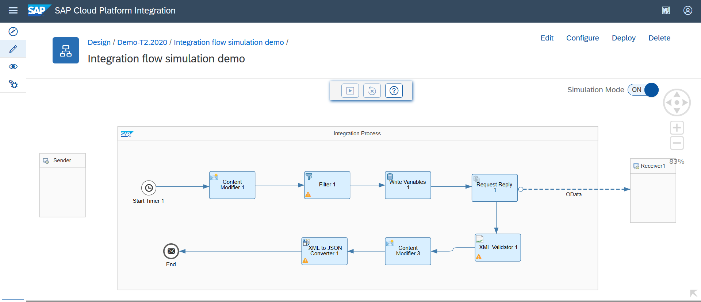
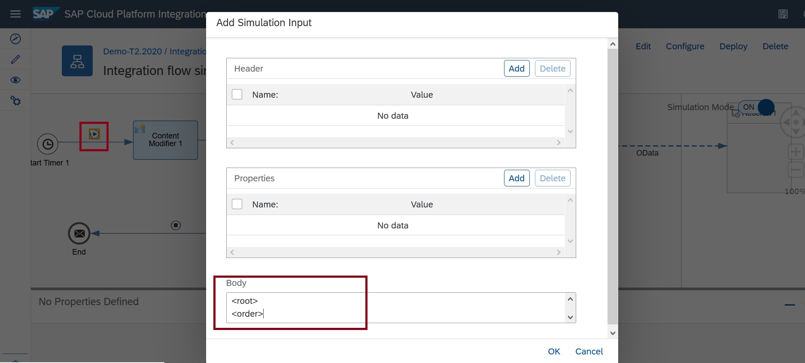
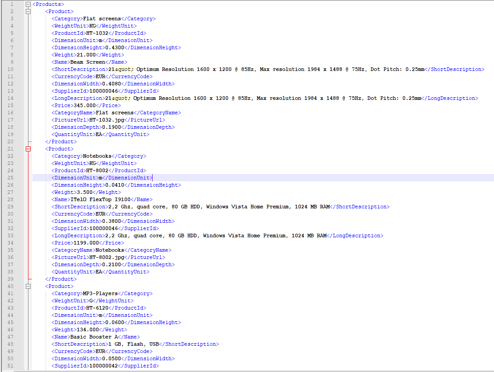
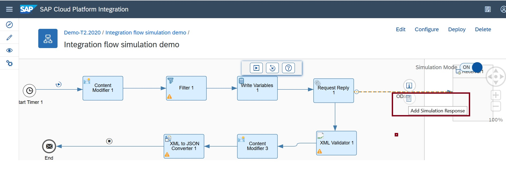
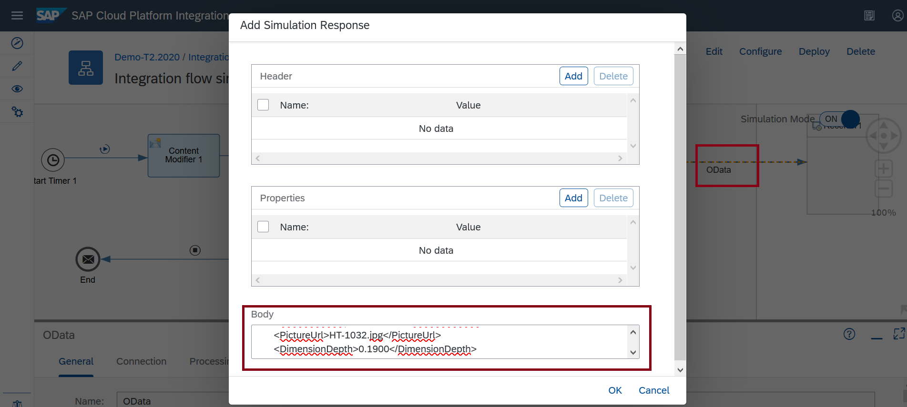
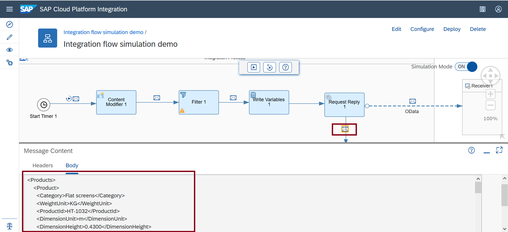
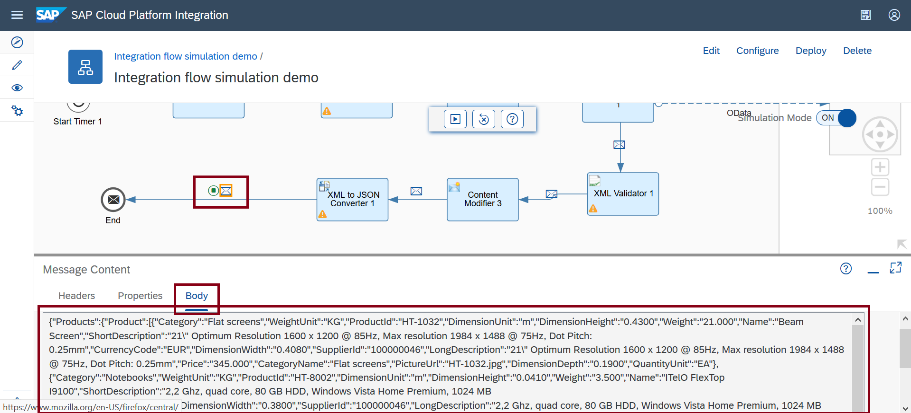

# Simulate the Response from Receiver System
|[Kamlesh Zanje](https://github.com/kamleshzanje)|
----|----|

This recipe will explain how to simulate the response from the receiver system by leveraging Integration Flow Simulation feature.  

To know more about this feature and various functionalities, please refer the reference section.


[Download the integration flow sample](Integration flow simulation demo.zip)

## Recipe

Step|Code|Why?
----|----|----
Open integration flow in read mode | | Simulation feature as of now is available in the read-mode of integration flow. On the top right corner of the integration flow editor, you see a toggle button that helps you to enable the simulation. It is switched off by default.
 Switch on simulation mode| | On enabling the Simulation button, the simulation tool appears over the integration flow. This tool let you run simulation, clear simulation.
Define start point ||To define the start point of your simulation. Click on the connector line where you need to define the start of your simulation. In our scenario, it would be after start timer event.
Define end point ||To define the end point of your simulation. Click on the connector where you need to define the end of your simulation. Here, it would be after XML to JSON Converter step.
Provide an input to simulate the flow||To start simulation, message input is required. Click start point which will open the simulation input dialog. You can add a header value or a property or, you can enter a payload in the body. Provide simulated order details as a payload.
Simulate response from Receiver system|| Simulate the incoming product details from the receiver system. Select the OData Receiver Adapter, Add Simulation  Response speed button would appear. On click of this speed button, a dialog would appear to simulate the response from the receiver system.
Run Simulation|| Click the Run simulation from the Simulation tool.
Clear Simulation|| In order to clear the simulation input, output and commence to test other subset of integration flow.


## References
* [Integration Flow Simulation product documentation](https://help.sap.com/viewer/368c481cd6954bdfa5d0435479fd4eaf/Cloud/en-US/2e2210b6db0c4fdb937b3a57d952f582.html)
* [Integration Flow Simulation blog post](https://blogs.sap.com/2020/04/13/integration-flow-simulation-in-sap-cloud-platform-integration/)


## Sample integration flow
The scenario depicted in this integration flow is about the sender system sends the order details and the product details corresponding to the order number is requested from the receiver system which is then later validated and converted from XML to JSON format.

Integration flow constitutes of various steps like content modifier, Filter, write variable, Request-Reply, OData Receiver Adapter, XML Validator and XML to JSON Converter




### Input Payload
This is the simulation input payload used in the sample integration flow. Select the Start point, the XML payload provide in should be feed in the Simulation Input Dialog.
```
<root>
<order>
<orderno>OD0001</orderno>
</order>
</root>

```




### Response payload
This is the Simulated response from the receiver system. Select the OData Receiver Adapter, the XML Payload provide in should be feed in the Add Simulation Response Dialog.
```
<Products>
    <Product>
      <Category>Flat screens</Category>
      <WeightUnit>KG</WeightUnit>
      <ProductId>HT-1032</ProductId>
      <DimensionUnit>m</DimensionUnit>
      <DimensionHeight>0.4300</DimensionHeight>
      <Weight>21.000</Weight>
      <Name>Beam Screen</Name>
      <ShortDescription>21&quot; Optimum Resolution 1600 x 1200 @ 85Hz, Max resolution 1984 x 1488 @ 75Hz, Dot Pitch: 0.25mm</ShortDescription>
      <CurrencyCode>EUR</CurrencyCode>
      <DimensionWidth>0.4080</DimensionWidth>
      <SupplierId>100000046</SupplierId>
      <LongDescription>21&quot; Optimum Resolution 1600 x 1200 @ 85Hz, Max resolution 1984 x 1488 @ 75Hz, Dot Pitch: 0.25mm</LongDescription>
      <Price>345.000</Price>
      <CategoryName>Flat screens</CategoryName>
      <PictureUrl>HT-1032.jpg</PictureUrl>
      <DimensionDepth>0.1900</DimensionDepth>
      <QuantityUnit>EA</QuantityUnit>
    </Product>
    <Product>
      <Category>Notebooks</Category>
      <WeightUnit>KG</WeightUnit>
      <ProductId>HT-8002</ProductId>
      <DimensionUnit>m</DimensionUnit>
      <DimensionHeight>0.0410</DimensionHeight>
      <Weight>3.500</Weight>
      <Name>ITelO FlexTop I9100</Name>
      <ShortDescription>2,2 Ghz, quad core, 80 GB HDD, Windows Vista Home Premium, 1024 MB RAM</ShortDescription>
      <CurrencyCode>EUR</CurrencyCode>
      <DimensionWidth>0.3800</DimensionWidth>
      <SupplierId>100000046</SupplierId>
      <LongDescription>2,2 Ghz, quad core, 80 GB HDD, Windows Vista Home Premium, 1024 MB RAM</LongDescription>
      <Price>1199.000</Price>
      <CategoryName>Notebooks</CategoryName>
      <PictureUrl>HT-8002.jpg</PictureUrl>
      <DimensionDepth>0.2100</DimensionDepth>
      <QuantityUnit>EA</QuantityUnit>
    </Product>
    <Product>
      <Category>MP3-Players</Category>
      <WeightUnit>G</WeightUnit>
      <ProductId>HT-6120</ProductId>
      <DimensionUnit>m</DimensionUnit>
      <DimensionHeight>0.0600</DimensionHeight>
      <Weight>134.000</Weight>
      <Name>Basic Booster A</Name>
      <ShortDescription>1 GB, Flash, USB</ShortDescription>
      <CurrencyCode>EUR</CurrencyCode>
      <DimensionWidth>0.0500</DimensionWidth>
      <SupplierId>100000042</SupplierId>
      <LongDescription>1 GB, Flash, USB</LongDescription>
      <Price>45.000</Price>
      <CategoryName>MP3-Players</CategoryName>
      <PictureUrl>HT-6120.jpg</PictureUrl>
      <DimensionDepth>0.0180</DimensionDepth>
      <QuantityUnit>EA</QuantityUnit>
    </Product>
  </Products>
```







### Run Simulation

Once all the necessary input and response payload is provided, you can run the simulation. Once the simulation is complete, the response payload from Receiver system has been received, XML is validated and also been successfully converted from XML into the JSON format.





This ends the recipe of the integration flow simulation.
